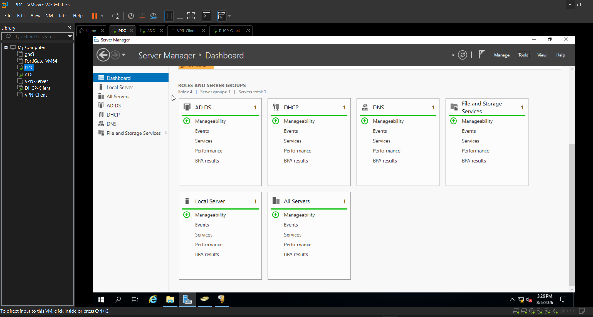

# DNS

DNS is visibly listed as an installed and manageable role in the PDC Server Manager view.

## Evidence Summary

The screenshot confirms that DNS is present as a server role in the lab. The screenshots do not provide enough confirmed detail about DNS zones, records, forwarders, resolution tests, or client DNS settings. Those details are **Not confirmed from the available evidence.**
